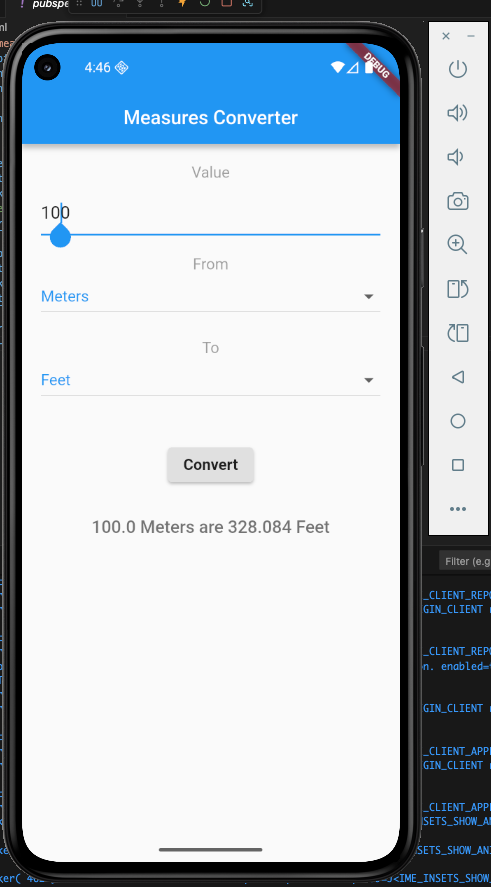

# Measures Converter

A Flutter application developed for converting measurements between Metric and Imperial systems. This app allows users to input a value, select a starting unit (e.g., Meters, Kilograms), and convert it to a target unit (e.g., Feet, Pounds).

## Features

* **Unit Conversion**: Supports conversion for Distance (Meters, Kilometers, Feet, Miles) and Weight (Kilograms, Pounds).
* **Input Validation**: Ensures users enter valid numbers and prevents incompatible conversions (e.g., Weight to Distance).
* **User Interface**: Clean layout using Material Design components.

## Application Output

The screenshot of the running application is named **`output.png`** and is located in the **root folder** of this repository.



## Getting Started

To run this project locally, follow these steps:

### Prerequisites

* [Flutter SDK](https://flutter.dev/docs/get-started/install) installed.
* An IDE (VS Code or Android Studio) configured with Flutter plugins.

### Installation & Run

1.  **Clone the repository:**
    ```bash
    git clone https://github.com/ucajalrc/Flutter-app-using-dart
    ```

2.  **Navigate to the project directory:**
    ```bash
    cd measures_converter
    ```

3.  **Install dependencies:**
    ```bash
    flutter pub get
    ```

4.  **Run the application:**
    ```bash
    flutter run
    ```